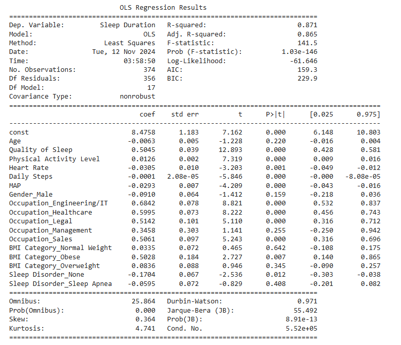
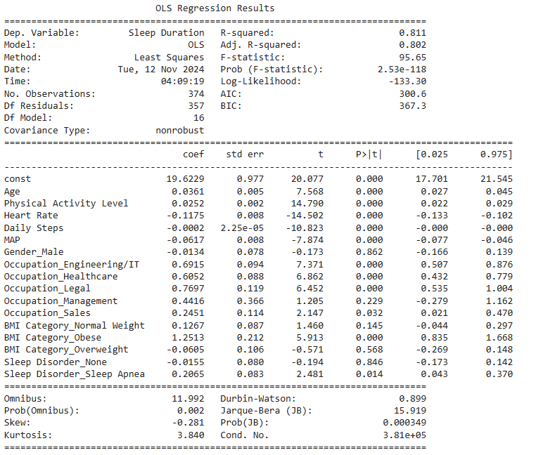
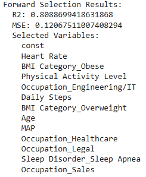
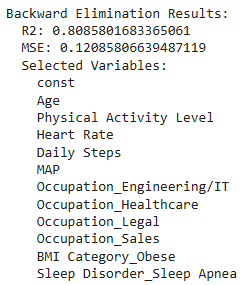
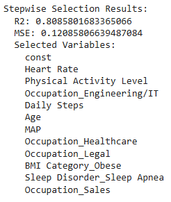
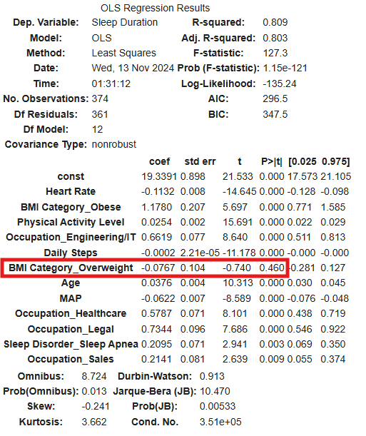
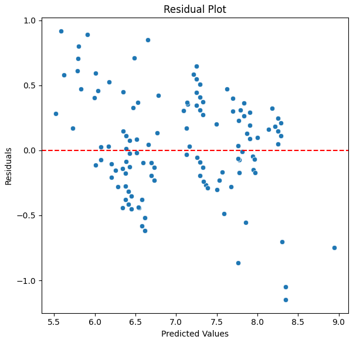
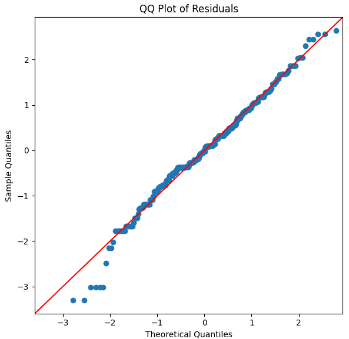
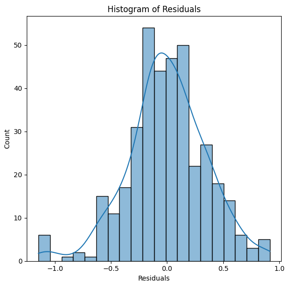

# <div align="center">Analysis of Sleep Duration and its Influencing Factors Using MLR</div>
## <div align="center">

Insufficient sleep has been linked to various health problems, including heart disease, obesity, and diabetes. Understanding factors that impact sleep duration can help in creating interventions for better health outcomes.

## Problem Statement
The purpose of this analysis is to understand the relationships between various health and lifestyle factors and sleep duration. Specifically, we seek to identify which variables (such as age, heart rate, physical activity level, BMI category, and occupation) are most predictive of sleep duration in a sample population. Using multiple linear regression (MLR), we aim to build an optimal model to predict sleep duration based on these variables and evaluate the model's accuracy and assumptions.

## Objective
Identify and quantify the relationship between sleep duration and various health and lifestyle factors, including demographic information, physiological metrics, and lifestyle behaviors.

## Data Description
The source of the data is from [Sleep Health and Lifestyle Dataset](https://www.kaggle.com/datasets/uom190346a/sleep-health-and-lifestyle-dataset)

### **Columns Explanation:**
- Person ID: *An identifier for each individual.*
- Gender: *The gender of the person (Male/Female).*
- Age: *The age of the person in years.*
- Occupation: *The occupation or profession of the person.*
- Sleep Duration (hours): *The number of hours the person sleeps per day.*
- Quality of Sleep (scale: 1-10): *A subjective rating of the quality of sleep, ranging from 1 to 10.*
- Physical Activity Level (minutes/day): *The number of minutes the person engages in physical activity daily.*
- Stress Level (scale: 1-10): *A subjective rating of the stress level experienced by the person, ranging from 1 to 10.*
- BMI Category: *The BMI category of the person (e.g., Underweight, Normal, Overweight).*
- Blood Pressure (systolic/diastolic): *The blood pressure measurement of the person, indicated as systolic pressure over diastolic pressure.*
- Heart Rate (bpm): *The resting heart rate of the person in beats per minute.*
- Daily Steps: *The number of steps the person takes per day.*
- Sleep Disorder: *The presence or absence of a sleep disorder in the person (None, Insomnia, Sleep Apnea).*
### **Details about Sleep Disorder Column:**
- None: *The individual does not exhibit any specific sleep disorder.*
- Insomnia: *The individual experiences difficulty falling asleep or staying asleep, leading to inadequate or poor-quality sleep.*
- Sleep Apnea: *The individual suffers from pauses in breathing during sleep, resulting in disrupted sleep patterns and potential health risks.*

The dataset contains information on 374 individuals, each with various demographic, health, and lifestyle attributes. The target variable is **Sleep Duration**, measured in hours

### **Data Cleaning**

#### 1. Checking the Total Number of Missing Values
``` Python
df.isnull().sum().to_frame().rename(columns={0:"Total No. of Missing Values"})
```
Note: The Sleep Disorder variable has incorrectly captured 219 missing values. In the raw data, these missing values are labeled as 'None'. To fix this, we replace "NaN" with "None".
``` Python
df['Sleep Disorder'].fillna("None",inplace=True)

print(df['Sleep Disorder'].value_counts())
```
#### 2. Standardize Categories
1. To standardize the "BMI Category" so that both "Normal" and "Normal Weight" are categorized as "Normal".
2. To standardize the "Occupation" so that both "Sales Representative" and "Salesperson" are categorized as "Normal".
``` Python
df['Occupation'].replace({'Sales Representative': 'Salesperson'}, inplace=True)
df['BMI Category'].replace({'Normal Weight','Normal'}, inplace=True)
```
#### 3. Define occupation groups
Since there are many different occupations listed, we standardized them by grouping similar occupations together.
``` Python
occupation_mapping = {
    'Doctor': 'Healthcare',
    'Nurse': 'Healthcare',
    'Software Engineer': 'Engineering/IT',
    'Engineer': 'Engineering/IT',
    'Scientist': 'Engineering/IT',
    'Teacher': 'Education',
    'Salesperson': 'Sales',
    'Lawyer': 'Legal',
    'Manager': 'Management'
}

# Apply the occupation mapping
df['Occupation'] = df['Occupation'].map(occupation_mapping)
```
#### 4. Define Blood Pressure to MAP
Since there are many different blood pressure values, and if we encode them, there will be so many columns and to avoid this we standardized them by calculating the Mean Arterial Pressure (MAP) for easier grouping and analysis.
``` Python
def calculate_map(bp):
    try:
        systolic, diastolic = map(int, bp.split('/'))
        return (systolic + 2 * diastolic) / 3
    except:
        return None  # Return None if there's an issue with format

# Calculate MAP for blood pressure
df['MAP'] = df['Blood Pressure'].apply(calculate_map)
```
#### 5. One-Hot Encoding and Data Transformation
Drop unnecessary columns and encode categorical variables
``` Python
df = df.drop(['Person ID', 'Blood Pressure'], axis=1)

df = pd.get_dummies(df, drop_first=True)

# Convert all boolean columns to integer (1 for True, 0 for False)
df = df.apply(lambda x: x.astype(int) if x.dtype == 'bool' else x)


df
```


## **The Models:**
### 1. Multiple Linear Regression (MLR) 📊 
MLR is included all potential predictors, yielding a summary of each predictor’s statistical significance (p-values) and multicollinearity through Variance Inflation Factor (VIF) values. 


**Insights:**

- This model explains 88.5% of the variation in sleep duration.
- Variables like Age, Quality of Sleep, Physical Activity Level, and Stress Level are statistically significant. This suggests they are meaningful predictors of Sleep Duration.
- There were also several variables that are not significant such as Heart Rate, Occupation_Management, BMI Category_Normal Weight, BMI Category_Obese, BMI Category_Overweight, Sleep Disorder_Sleep Apnea
- Now, lets compare with VIF!


**Insights:**

- Quality of Sleep and Stress Level have very high VIFs (23.75 and 19.63 respectively), indicating multicollinearity. This suggests that these predictors are highly correlated with other features.

**Plan**: 

We will remove one by one the highly correlated variables (Quality of Sleep, Stress Level, or Age) and check whether the reading is reduce.

### **Refining the Model by Checking and Comparing VIF Values:**

**1. Removing "Stress Level" due to high multicollinearity."**


    


**Insights:**

The R2 value decreased to 87% of the variation in sleep duration. The value is still can consider high for the model. The VIF value, have improved a lot compared to before. We will now remove Quality of Sleep.

**2 .Removing "Quality of Sleep" to further reduce multicollinearity"**




**Insights:**

- After removing the Quality of Sleep variable, although the R² value dropped drastically to 81%, indicating that only 81% of the variation in sleep duration is explained, the VIFs have generally improved. While a VIF below 5 indicates low multicollinearity, VIF values between 5 and 10 suggest moderate multicollinearity, which may be acceptable.

**Note:** 

We decided not to remove any more variables, as I’m concerned that it might limit the ability to gain insights into sleep health.

### 2. Best MLR Model 🦾

We use **forward selection**, **backward elimination**, and **stepwise selection** to help us choose the best set of variables (predictors) for building a Multiple Linear Regression (MLR) model. The goal is to find a model that is simple, accurate, and doesn’t include unnecessary variables.

Here’s why each method is used:

1. **Forward Selection**: This method starts with no variables in the model and adds one variable at a time. At each step, it pick the variable that improves the model the most. This helps to avoid adding too many irrelevant variables from the start and focuses on the important ones.

2. **Backward Elimination**: In this method, it start with all variables in the model and then remove the least useful one at a time. If a variable does not improve the model, it is eliminated. This helps to simplify the model by keeping only relevant variables.

3. **Stepwise Selection**: This method is a mix of both forward selection and backward elimination. It starts with an empty model or a full model and both adds and removes variables at each step. It’s a good balance because it looks at all possibilities and adjusts the model to include only the best variables.

#### Below is the results:

<p align="left">
  
  
  
</p>

##### **Insights:**

- Each method offers a similar subset of features, with slight variations. At first, We are selecting the subset from Forward Selection as it have higher R2. However, in Forward Selection, 1 variable (BMI Category_Overweight) showing high p-value. Below is the prove.



- The final model, constructed with the variables selected through stepwise selection, achieved an R2 of 0.809. This indicates that 80.9% of the variance in Sleep Duration is explained by the selected predictors. Furthermore, all predictors in the model have p-values 
  below 0.05, indicating that each variable’s effect on Sleep Duration is statistically significant.

- The coefficients in the model provide insights into the relationship between each predictor and Sleep Duration.
  
  *For example, a one-unit increase in Physical Activity Level is associated with an additional 0.025 hours of sleep per night, holding all other variables constant.*

- We then proceed, selecting the subset from **stepwise selection**.

## **Variable Selection Steps**

``` Python
# Variable selection to find the best MLR model for the data

def forward_selection(X, y, significance_level=0.05):
    """Performs forward selection to select variables for a regression model."""
    initial_features = []
    best_features = list(X.columns)

    while best_features:
        remaining_features = list(set(X.columns) - set(initial_features))
        new_pval = pd.Series(index=remaining_features, dtype=float)

        for new_column in remaining_features:
            model = sm.OLS(y, sm.add_constant(X[initial_features + [new_column]])).fit()
            new_pval[new_column] = model.pvalues[new_column]

        min_p_value = new_pval.min()
        if min_p_value < significance_level:
            best_feature = new_pval.idxmin()
            initial_features.append(best_feature)
        else:
            break

    return initial_features

def backward_elimination(X, y, significance_level=0.05):
    """Performs backward elimination to select variables for a regression model."""
    features = list(X.columns)

    while features:
        model = sm.OLS(y, sm.add_constant(X[features])).fit()
        p_values = model.pvalues[1:]  # Exclude intercept
        max_p_value = p_values.max()

        if max_p_value >= significance_level:
            excluded_feature = p_values.idxmax()
            features.remove(excluded_feature)
        else:
            break

    return features

def stepwise_selection(X, y, significance_level_in=0.05, significance_level_out=0.05):
    """Performs stepwise selection to select variables for a regression model."""
    included = []

    while True:
        changed = False
        # Forward step
        excluded = list(set(X.columns) - set(included))
        new_pval = pd.Series(index=excluded, dtype=float)

        for new_column in excluded:
            model = sm.OLS(y, sm.add_constant(X[included + [new_column]])).fit()
            new_pval[new_column] = model.pvalues[new_column]

        min_p_value = new_pval.min()
        if min_p_value < significance_level_in:
            best_feature = new_pval.idxmin()
            included.append(best_feature)
            changed = True

        # Backward step
        model = sm.OLS(y, sm.add_constant(X[included])).fit()
        p_values = model.pvalues[1:]  # Exclude intercept
        max_p_value = p_values.max()

        if max_p_value > significance_level_out:
            worst_feature = p_values.idxmax()
            included.remove(worst_feature)
            changed = True

        if not changed:
            break

    return included

# Function to fit model and calculate R-squared and MSE
def evaluate_model(features, X, y):
    X_eval = sm.add_constant(X[features])
    model = sm.OLS(y, X_eval).fit()
    y_pred = model.predict(X_eval)
    r2 = r2_score(y, y_pred)
    mse = mean_squared_error(y, y_pred)
    return r2, mse

# Apply variable selection methods
selected_features_forward = forward_selection(X_reduced_2, y)
selected_features_backward = backward_elimination(X_reduced_2, y)
selected_features_stepwise = stepwise_selection(X_reduced_2, y)

# Evaluate models with selected features from each method
results = {
    "Forward Selection": evaluate_model(selected_features_forward, X_reduced_2, y),
    "Backward Elimination": evaluate_model(selected_features_backward, X_reduced_2, y),
    "Stepwise Selection": evaluate_model(selected_features_stepwise, X_reduced_2, y)
}

# Prepare a structured result to include R2, MSE, and selected variables
detailed_results = {
    "Forward Selection": {
        "R2": results["Forward Selection"][0],
        "MSE": results["Forward Selection"][1],
        "Variables": selected_features_forward
    },
    "Backward Elimination": {
        "R2": results["Backward Elimination"][0],
        "MSE": results["Backward Elimination"][1],
        "Variables": selected_features_backward
    },
    "Stepwise Selection": {
        "R2": results["Stepwise Selection"][0],
        "MSE": results["Stepwise Selection"][1],
        "Variables": selected_features_stepwise
    }
}


for method, metrics in detailed_results.items():
    print(f"{method} Results:")
    print(f"  R2: {metrics['R2']}")
    print(f"  MSE: {metrics['MSE']}")
    print("  Selected Variables:")
    for var in metrics['Variables']:
        print(f"    {var}")  # Each variable is printed on a new line
    print("\n")
```

## **Model Diagnostics (Residual Plots)**

Model diagnostics, specifically residual plots, are essential to check if our regression model assumptions hold. Residuals are the differences between the observed values (actual data) and the predicted values (model’s predictions). By examining these residuals, we can see if our model is working as expected and if it’s a good fit for the data.

The key things we look for in residual plots are:

1. **Random Scatter**: Residuals should be randomly scattered around zero. This indicates that our model has captured the relationship well.
   
3. **No Pattern**: If there’s a pattern (e.g., a curve), it suggests that the model might be missing something, like a non-linear relationship.
   
5. **Constant Spread (Homoscedasticity)**: The spread of residuals should be roughly the same across all predicted values. If the spread changes, it suggests issues like heteroscedasticity (non-constant variance).

These checks help us confirm that our model is accurate, unbiased, and reliable for prediction.

### **1. Residual Plot:**

- The residual plot shows residuals (errors) on the y-axis versus predicted values on the x-axis. Ideally, residuals should be randomly scattered around zero without any discernible pattern, which suggests that the model has captured the linear relationships well and meets the assumption of homoscedasticity (constant variance).



While the residuals are mostly centered around zero, there appears to be a slight pattern with residuals tending to fan out more as the predicted values increase. This indicates potential mild heteroscedasticity, meaning that the error variance might not be perfectly constant across all levels of predicted values. However, this pattern is relatively weak and might not significantly impact the model's performance.

### **2. QQ Plot:**

- The QQ plot compares the distribution of the residuals to a theoretical normal distribution. If the residuals are normally distributed, they should closely follow the red line in the plot.
  


The residuals largely follow the reference line, especially in the central part of the distribution. There are some minor deviations at the tails, with a few points departing from the line. This suggests that the residuals are approximately normally distributed but may exhibit slight skewness or kurtosis at the extremes. This slight deviation from normality is common in real-world data and generally acceptable if it is not severe.

### **3. Histogram of Residuals:**

- The histogram provides a more visual indication of the residual distribution's shape, showing whether residuals are symmetrically distributed around zero.
  


The histogram shows a roughly normal, bell-shaped distribution centered around zero. The kernel density estimate (KDE) overlay confirms this shape, with a slight leftward skew, as indicated by a few outliers on the left side. The overall symmetry supports the approximate normality assumption, though the small skew may warrant caution if further model refinement is desired.

## **Conclusion**

In conclusion, our analysis identified several significant predictors of sleep duration, with Heart Rate, Physical Activity Level, and Occupation categories among the most impactful. The final model achieved an R2 of 0.8086, indicating that it explains 80.86% of the variance in sleep duration. Although minor assumptions deviations were noted, the model provides valuable insights for understanding the role of lifestyle factors in sleep health. Future studies could enhance these findings by collecting additional data on  dietary factors or exploring non-linear models for improved accuracy
