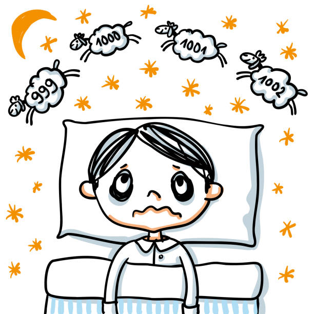
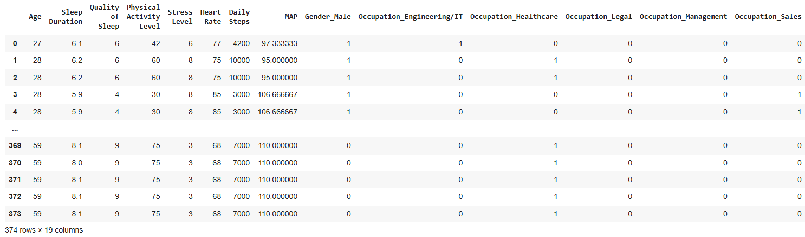
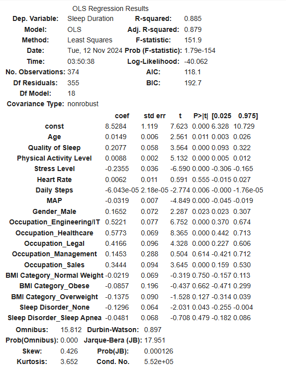
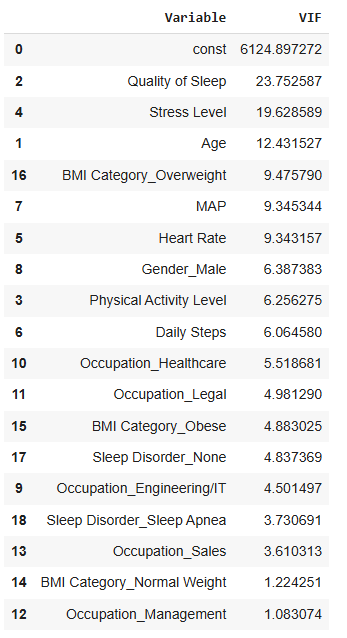
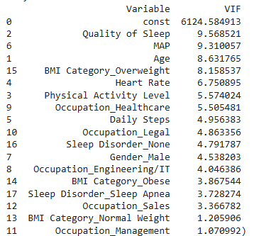
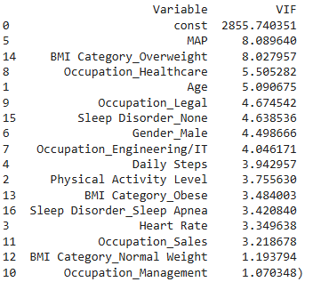

# <div align="center">Analysis of Sleep Duration and its Influencing Factors Using MLR</div>
## <div align="center">

Insufficient sleep has been linked to various health problems, including heart disease, obesity, and diabetes. Understanding factors that impact sleep duration can help in creating interventions for better health outcomes.

## Problem Statement
The purpose of this analysis is to understand the relationships between various health and lifestyle factors and sleep duration. Specifically, we seek to identify which variables (such as age, heart rate, physical activity level, BMI category, and occupation) are most predictive of sleep duration in a sample population. Using multiple linear regression (MLR), we aim to build an optimal model to predict sleep duration based on these variables and evaluate the model's accuracy and assumptions.

## Objective
Identify and quantify the relationship between sleep duration and various health and lifestyle factors, including demographic information, physiological metrics, and lifestyle behaviors.

## Data Description
The source of the data is from [Sleep Health and Lifestyle Dataset](https://www.kaggle.com/datasets/uom190346a/sleep-health-and-lifestyle-dataset)

### **Columns Explanation:**
- Person ID: *An identifier for each individual.*
- Gender: *The gender of the person (Male/Female).*
- Age: *The age of the person in years.*
- Occupation: *The occupation or profession of the person.*
- Sleep Duration (hours): *The number of hours the person sleeps per day.*
- Quality of Sleep (scale: 1-10): *A subjective rating of the quality of sleep, ranging from 1 to 10.*
- Physical Activity Level (minutes/day): *The number of minutes the person engages in physical activity daily.*
- Stress Level (scale: 1-10): *A subjective rating of the stress level experienced by the person, ranging from 1 to 10.*
- BMI Category: *The BMI category of the person (e.g., Underweight, Normal, Overweight).*
- Blood Pressure (systolic/diastolic): *The blood pressure measurement of the person, indicated as systolic pressure over diastolic pressure.*
- Heart Rate (bpm): *The resting heart rate of the person in beats per minute.*
- Daily Steps: *The number of steps the person takes per day.*
- Sleep Disorder: *The presence or absence of a sleep disorder in the person (None, Insomnia, Sleep Apnea).*
### **Details about Sleep Disorder Column:**
- None: *The individual does not exhibit any specific sleep disorder.*
- Insomnia: *The individual experiences difficulty falling asleep or staying asleep, leading to inadequate or poor-quality sleep.*
- Sleep Apnea: *The individual suffers from pauses in breathing during sleep, resulting in disrupted sleep patterns and potential health risks.*

The dataset contains information on 374 individuals, each with various demographic, health, and lifestyle attributes. The target variable is **Sleep Duration**, measured in hours

### **Data Cleaning**

#### 1. Checking the Total Number of Missing Values
``` Python
df.isnull().sum().to_frame().rename(columns={0:"Total No. of Missing Values"})
```
Note: The Sleep Disorder variable has incorrectly captured 219 missing values. In the raw data, these missing values are labeled as 'None'. To fix this, we replace "NaN" with "None".
``` Python
df['Sleep Disorder'].fillna("None",inplace=True)

print(df['Sleep Disorder'].value_counts())
```
#### 2. Standardize Categories
1. To standardize the "BMI Category" so that both "Normal" and "Normal Weight" are categorized as "Normal".
2. To standardize the "Occupation" so that both "Sales Representative" and "Salesperson" are categorized as "Normal".
``` Python
df['Occupation'].replace({'Sales Representative': 'Salesperson'}, inplace=True)
df['BMI Category'].replace({'Normal Weight','Normal'}, inplace=True)
```
#### 3. Define occupation groups
Since there are many different occupations listed, we standardized them by grouping similar occupations together.
``` Python
occupation_mapping = {
    'Doctor': 'Healthcare',
    'Nurse': 'Healthcare',
    'Software Engineer': 'Engineering/IT',
    'Engineer': 'Engineering/IT',
    'Scientist': 'Engineering/IT',
    'Teacher': 'Education',
    'Salesperson': 'Sales',
    'Lawyer': 'Legal',
    'Manager': 'Management'
}

# Apply the occupation mapping
df['Occupation'] = df['Occupation'].map(occupation_mapping)
```
#### 4. Define Blood Pressure to MAP
Since there are many different blood pressure values, and if we encode them, there will be so many columns and to avoid this we standardized them by calculating the Mean Arterial Pressure (MAP) for easier grouping and analysis.
``` Python
def calculate_map(bp):
    try:
        systolic, diastolic = map(int, bp.split('/'))
        return (systolic + 2 * diastolic) / 3
    except:
        return None  # Return None if there's an issue with format

# Calculate MAP for blood pressure
df['MAP'] = df['Blood Pressure'].apply(calculate_map)
```
#### 5. One-Hot Encoding and Data Transformation
Drop unnecessary columns and encode categorical variables
``` Python
df = df.drop(['Person ID', 'Blood Pressure'], axis=1)

df = pd.get_dummies(df, drop_first=True)

# Convert all boolean columns to integer (1 for True, 0 for False)
df = df.apply(lambda x: x.astype(int) if x.dtype == 'bool' else x)


df
```


## **The Models:**
### 1. Multiple Linear Regression (MLR) 📊 
MLR is included all potential predictors, yielding a summary of each predictor’s statistical significance (p-values) and multicollinearity through Variance Inflation Factor (VIF) values. 



**Insights:**

- This model explains 88.5% of the variation in sleep duration.
- Variables like Age, Quality of Sleep, Physical Activity Level, and Stress Level are statistically significant. This suggests they are meaningful predictors of Sleep Duration.
- There were also several variables that are not significant such as Heart Rate, Occupation_Management, BMI Category_Normal Weight, BMI Category_Obese, BMI Category_Overweight, Sleep Disorder_Sleep Apnea
- Now, lets compare with VIF!



**Insights:**

- Quality of Sleep and Stress Level have very high VIFs (23.75 and 19.63 respectively), indicating multicollinearity. This suggests that these predictors are highly correlated with other features.

- Plan: We will remove one by one the highly correlated variables (Quality of Sleep, Stress Level, or Age) and check whether the reading is reduce.

### **Comparing VIF values by:**

**1. Removing "Stress Level"**
    


**Insights:**

The VIF value, have improved a lot compared to before. We will now remove Quality of Sleep.

**2 . Removing "Quality of Sleep"**



**Insights:**

- After removing Quality of Sleep, the VIFs have generally improved. Although a VIF below 5 indicates low multicollinearity, VIF values between 5 and 10 suggest moderate multicollinearity, which may be acceptable.

- **Note:** I decided not to remove any more variables, as I’m concerned that it might limit my ability to gain insights into sleep health.

### 2. Best MLR Model 🦾
Through variable selection techniques (forward selection, backward elimination, and stepwise selection), we identified an optimal subset of predictors. Stepwise selection was chosen as the preferred method, balancing model simplicity with predictive accuracy. The final selected predictors were:
- Heart Rate
- Physical Activity Level
- Occupation_Engineering/IT
- Daily Steps
- Age
- MAP (Mean Arterial Pressure)
- Occupation_Healthcare
- Occupation_Legal
- BMI Category_Obese
- Sleep Disorder_Sleep Apnea
- Occupation_Sales
  
**Model Performance:**

- R-Squared: 0.8086
- Mean Squared Error (MSE): 0.1209

